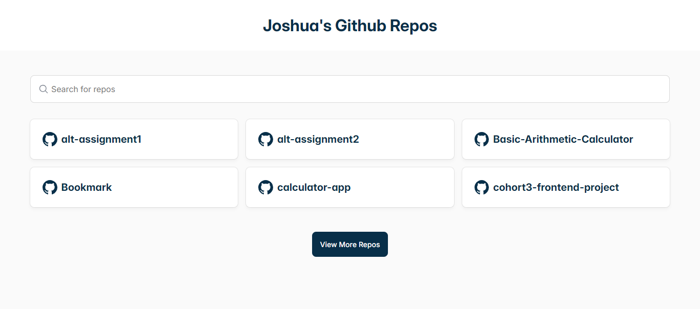

# Github Repo App

This React application fetches my GitHub repositories using the GitHub API and displays them in a user-friendly interface. It features pagination, search capabilities, detailed repository views through nested routes, error boundaries and a 404 page for non-existent routes

## Installation:

- Clone the repository: git clone https://github.com/joshua-emmanuel/github-repo-app.git
- Install dependencies: `npm install`
- Start the development server: `npm run dev`

## Features:

### Repository Listing:

- Fetches my GitHub repositories using the GitHub API.
- Displays repositories in a clear and well-formatted list.
- Implements pagination for efficient navigation through large numbers of repositories.

### Search:

- Provides a search bar to find repositories by name.

### Single Repository View:

- Uses nested routes to navigate to a dedicated page for each repository.
- Displays detailed information about the selected repository (name, description, language, stars, forks, etc.).

### Error Boundary:

- Catches and gracefully handles unexpected errors that might occur during data fetching or rendering.
- Displays a user-friendly message in case of errors, preventing the entire application from crashing.

### 404 Page:

- Presents a custom page when the user attempts to access a non-existent route.
- Provides navigation options back to the main repository list.
